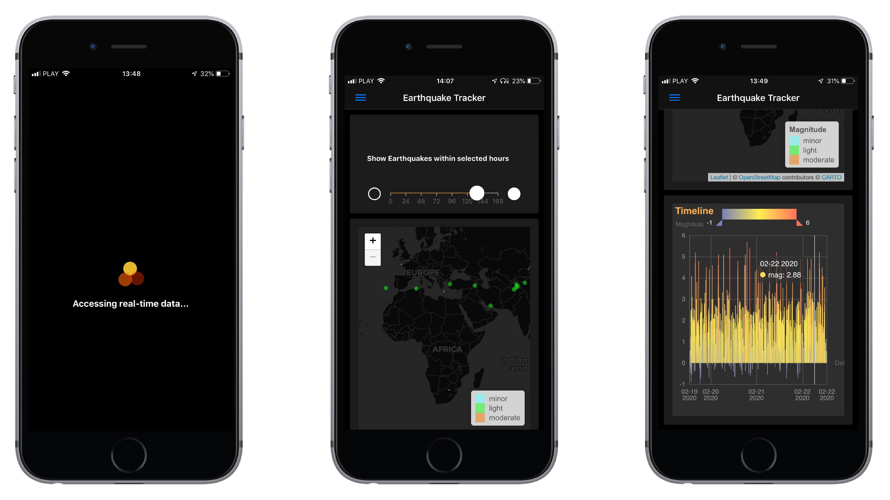

<div align="center">

<p align="center">
  
</p>


<!-- README.md is generated from README.Rmd. Please edit that file -->


## mobilequake

<!-- badges: start -->
<!-- badges: end -->

Dashboard to track Earthquakes in real-time, based on [USGS data](https://earthquake.usgs.gov/). The app is built with [shinyMobile](https://rinterface.github.io/shinyMobile/) & [echarts4r](https://echarts4r.john-coene.com/) & [leaflet](http://rstudio.github.io/leaflet)

</div> 
## DEMO 

[Tracker](http://tools.dataatomic.com/shiny/mobilequake) 


## Get it

You can download the package and run it locally or deploy it.

``` r
# install.packages("remotes")
remotes::install_github("korur/mobilequake")
```

## How to run


```{r example, warning = FALSE, message = FALSE}
## Run the app
mobilequake::run_app()
```
