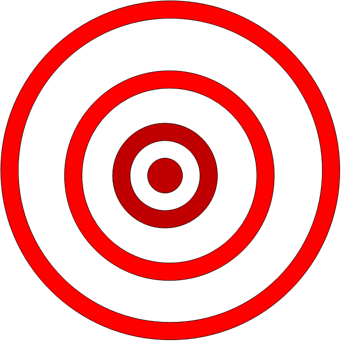

**Mobilequake**

<p align="center">
  
</p>
<!-- README.md is generated from README.Rmd. Please edit that file -->

```{r, include = FALSE}
getwd()
knitr::opts_chunk$set(
  collapse = TRUE,
  comment = "#>",
  fig.path = "man/figures/README-",
  out.width = "100%"
)
```

# mobilequake

<!-- badges: start -->
<!-- badges: end -->

        mobilequake Earthquake Tracker is a ShinyMobile app under development that tracks earthquakes in real-time.

## Installation

  You can install the development version of mobilequake by:

``` r
# install.packages("remotes")
remotes::install_github("korur/mobilequake")
```

## How to run


```{r example}
## basic example code
mobilequake::run_app()
```

What is special about using `README.Rmd` instead of just `README.md`? You can include R chunks like so:

```{r cars}
summary(cars)
```

You'll still need to render `README.Rmd` regularly, to keep `README.md` up-to-date.

You can also embed plots, for example:

```{r pressure, echo = FALSE}
plot(pressure)
```

In that case, don't forget to commit and push the resulting figure files, so they display on GitHub!
